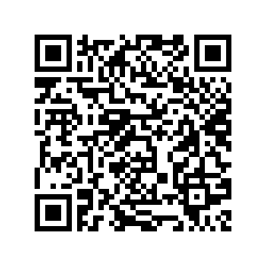

# FBI-Theme-Unistore
A collection of themes for the FBI app, collected and cataloged by me and created by many others. All credit for the themes go to the original authors. I do not claim to have made any of these individual themes. If you are an author and would like your theme removed, please contact me with proof it is yours and I will gladly take it down.

If you'd like a FBI theme added to the store or have any problems with an installed/installing a theme, please create a new issue in the Issues tab.

Unistore installation steps:
1. Make sure you have Universal-Updater on your 3DS
2. Open Universal-Updater and then select the gear icon on the bottom left
3. Select 'Select Unistore'
4. At the bottom center, tap on the plus icon
5. Select the QR icon in the bottom left and then scan this QR code.
6. You can now swap between the default homebrew store (Universal-DB) and this FBI themes store by going to 'Select Unistore'.

